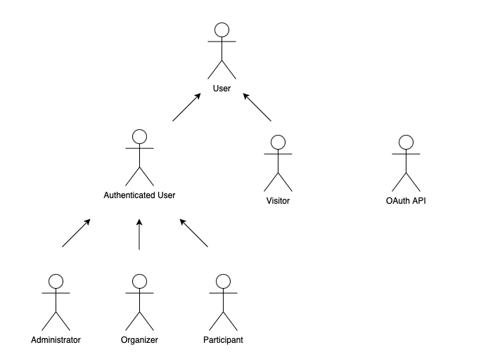
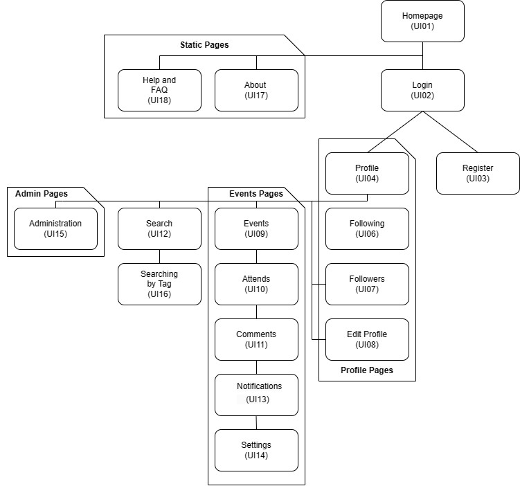
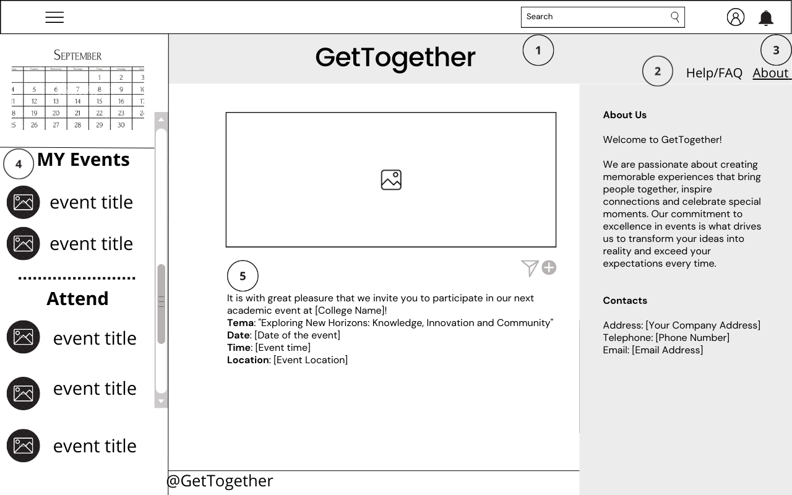

# ER: Requirements Specification Component

'GetTogether' is an innovative event management website that aims to make it easier to create, organize and participate in events of all types. Our vision is to provide an intuitive and comprehensive platform that connects people and makes the experience of planning and participating of more collaborative and memorable events.

## A1: GetTogether

The Get Together is a collaborative event management information system featuring a web-based interface. Users have the ability to sign in to the system and initiate both public and private events. In the context of each event, users can extend invitations to others, though these invites are not always accepted. Furthermore, the system enables users to share comments, upload files, and conduct polls within forums.

Users can be divided into two types, authenticated users and non-authenticated users. Both have the possibility of viewing public events and searching for a given event using its tag. In addition to these features, when users authenticate, they are able to create their own events, invite certain people to participate and manage their participants.

If the user decides to participate in a particular event, they can write and delete comments, answer the polls, upload files, vote on the comments, see the other participants and of course they can also leave the event.The organizer can edit the event details, create polls and also cancel the event. System administrators can search for events, view their details, manage event reports and delete events if necessary.

This project is being developed in an environment in which the organization of events plays an essencial role, including from companies that promote conferences, to groups of volunteers that coordinate community events. The event market is very dynamic and diversified with a growing search for effective solutions.

The platform boasts an adaptable design that ensures users enjoy a seamless browsing experience, regardless of their device, be it a desktop, tablet, or smartphone. Furthermore, the product prioritizes user-friendly navigation and strives to deliver an exceptional overall user experience.

---

## A2: Actors and User stories

This artifact comprises the delineation of the actors and their user stories, serving as agile project documentation for the project's requisites.

### 1. Actors

Figure 1: GetTogether actors.
  
| Identifier         | Description                                                                                                                                                                 |
|--------------------|-----------------------------------------------------------------------------------------------------------------------------------------------------------------------------|
| Visitor            | Unauthenticated user that can register itself (sign-up) or sign-in in the system                                                                                            |
| User               | Generic user that has access to public information, such as public events and can search and explore them                                                                   |
| Authenticated User | Authenticated user that can create events, invite users to public events, manage his events and all the ones attended/to attend and request to join an event                |
| Participant        | Authenticated user that can view event messages and attendees list, interact with people and participate in different activities within the event forum and leave any event |
| Organizer          | Authenticated user who for each event he created can: edit its details, manage its participants, create polls, manage the event's visibility and finally cancel the event   |
| Administrator      | Authenticated user that can browse events and see their details, manage event reports and in the last case, delete an event                                                 |
| OAuth API          | External OAuth API that can be used to register or authenticate into the system                                                                                             |

Table 1: GetTogether actors description.

### 2. User Stories

#### 2.1. Visitor

| Identifier | Name              | Priority | Description                                                                                                                                                    |
|------------|-------------------|----------|----------------------------------------------------------------------------------------------------------------------------------------------------------------|
| US01       | Sign-in           | high     | As a Visitor, I want to be able to authenticate into the system, so that I can access privileged information                                                   |
| US02       | Sign-up           | high     | As a Visitor, I want to be able to register myself into the system, so that I can authenticate myself into the system                                          |
| US03       | OAuth API Sign-up | low      | As a Visitor, I want to be able to register a new account linked to my Google account, so that I do not need to create a whole new account to use the platform |
| US04       | OAuth API Sign-in | low      | As a Visitor, I want to be able to sign-in through my Google account, so that I can authenticate myself into the system                                        |

Table 2: Visitor user stories.

#### 2.2. User

| Identifier | Name             | Priority | Description                                                                                                                     |
|------------|------------------|----------|---------------------------------------------------------------------------------------------------------------------------------|
| US5        | See home         | high     | As a User, I want to be able to access the home page, so that I can see a brief presentation of the website                     |
| US6        | See about        | high     | As a User, I want to be able to access the about page, so that I can see a complete description of the website and its creators |
| US7        | Consult FAQ      | high     | As a User, I want to be able to access the FAQ, so that I can get quick answers to common questions                             |
| US8        | Consult contacts | high     | As a User, I want to be able to access contacts, so that I can come in touch with the platform creators                         |
| US9        | Search by tag    | medium   | As a User, I want to be able to search events by tag, so that I can quickly find the ones I am looking for                      |
| US10       | Search           | high     | As a User, I want to be able to search events, so that I can see a complete description of it                                   |

Table 3: User user stories.

#### 2.3. Authenticated User

| Identifier | Name                             | Priority | Description                                                                                                                                                                |
|------------|----------------------------------|----------|----------------------------------------------------------------------------------------------------------------------------------------------------------------------------|
| US11       | Create event                     | high     | As an Authenticated User, I want to be able to create events, so that I can plan and manage gatherings efficiently                                                         |
| US12       | Manage my events                 | high     | As an Authenticated User, I want to be able to view and manage the list of my events, to see all the events I have created and their details                               |
| US13       | Manage events attended/to attend | high     | As an Authenticated User, I want to be able to view and manage a list of events that I have attender or plan to attend, so that I can keep track of my event participation |
| US14       | Edite user profile               | medium   | As an Authenticated User, I want to be able to edit my profile, so that I can make any changes I want                                                                      |
| US15       | Request to join event            | medium   | As an Authenticated User, I want to be able to request to join an event that I’m interested in, so that I can participate in the event                                     |
| US16       | Invite users to public event     | low      | As an Authenticated User, I want to be able to invite anyone i’d like to have on my event, so that I can limit who participates on my event                                |

Table 4: Authenticated User user stories.

#### 2.4. Participant

| Identifier | Name                        | Priority | Description                                                                                                                                                                  |
|------------|-----------------------------|----------|------------------------------------------------------------------------------------------------------------------------------------------------------------------------------|
| US17       | Leave event                 | high     | As a Participant, I want to be able to leave an event which I had previously confirmed attendance, so that I can manage my event participation                               |
| US18       | View event messages         | high     | As a Participant, I want to be able to see event messages, so that I can always be updated                                                                                   |
| US19       | Manage invitations received | medium   | As a Participant, I want to be able to manage my invitations, so that I can can choose which events I will attend                                                            |
| US20       | Add comments                | medium   | As a Participant, I want to be able to add comments to an event, so that I can engage in discussions, ask questions and provide feedback related to the event                |
| US21       | View attendees list         | medium   | As a Participant, I want to be able to view the list of attendees who are also participating in the same event as me, so that I can see who else will be attending the event |
| US22       | Vote in comments            | low      | As a Participant, I want to be able to vote in the comments, so that I can provide my input or opinions on event-related questions                                           |
| US23       | Edit comment                | low      | As a Participant, I want to be able to edit any comment I made, so that I can correct mistakes, provide additional information, or update my contribution as needed          |
| US24       | Delet comment               | low      | As a Participant, I want to be able to delete a comment I previously posted, so that I can remove my contribution as needed                                                  |
| US25       | Answer polls                | low      | As a Participant, I want to be able to answer polls, so that I can provide my input or opinions on event-related questions                                                   |
| US26       | Upload files                | low      | As a Participant, I want to be able to upload files, so that I can share some files with other participants                                                                  |

Table 5: Participant user stories.

#### 2.4. Organizer

| Identifier | Name                       | Priority | Description                                                                                                                                                      |
|------------|----------------------------|----------|------------------------------------------------------------------------------------------------------------------------------------------------------------------|
| US27       | Manage event participants  | high     | As an Organizer, I want to be able to add and remove participants from my events, so that I can control who is going or not                                      |
| US28       | Manage event visibility    | high     | As an Organizer, I want to be able to change the visibility of my event so that I can control who can see/join it                                                |
| US29       | Manage requests            | high     | As an Organizer, I want to be able to manage and respond to join requests from users who wish to participate in my event, so that I can control event attendance |
| US30       | Edit event details         | high     | As an Organizer, I want to be able to edit some event details, so that I can correct mistakes, provide additional or update information                          |
| US31       | Invite user to my events   | medium   | As an Organizer, I want to be able to invite anyone i’d like to have on my event, so that I can limit who participates on my event                               |
| US32       | Cancel event               | medium   | As an Organizer, I want to be able to cancel an event that I have previously created, so that I can communicate event cancellations to participants              |
| US33       | Create polls               | low      | As an Organizer, I want to be able to create polls associated with an event, so that I can interact with participants specific topics related to the event       |
| US34       | Access statistics on Event | low      | As an Organized, I want to be able to access statistics related to an event I have organized, so that I can understand the event’s performance, engagement, etc  |
| US35       | Manage invitations sent    | low      | As an Organizer, I want to be able to manage all the invites I’ve sent, so that I can limit my invitations                                                       |

Table 6: Organizer user stories.

#### 2.5. Administrator

| Identifier | Name                 | Priority | Description                                                                                                                                   |
|------------|----------------------|----------|-----------------------------------------------------------------------------------------------------------------------------------------------|
| US36       | Browse events        | high     | As an Administrator, I want to be able to browse events, so that I can explore a variety of events                                            |
| US37       | View event details   | high     | As an Administrator, I want to be able to view the details of an event, so that I can access information about the event and its agenda       |
| US38       | Manage event reports | medium   | As an Administrator, I want to be able to access reports related to events, so that I can track an analyze event performance, attendance, etc |
| US39       | Manage users         | medium   | As an Administrator, I want to be able to delete an user, so that I can have a safe environment                                               |
| US40       | Delete event         | medium   | As an Administrator, I want to be able to delete an event, so that I can maintain the integrity of the platform and respond to user requests  |

Table 7: Administrator user stories.

### 3. Supplementary Requirements

This section contains business rules, technical requirements and other non-functional requirements on the project.

#### 3.1. Business rules
| Identifier | Name                  | Description                                                                                                    |
|------------|-----------------------|----------------------------------------------------------------------------------------------------------------|
| BR01       | Events Public/Private | Events can be public or private. Private events are not shown in search results.                               |
| BR02       | Admin                 | Administrator accounts are independent of the user accounts, i.e. they cannot create or participate in events. |
| BR03       | Events Organizer      | That is only one organizer per event. (The organizer can be a company or an association)                       |
| BR04       | Events tags           | That are specific tags that the events can and should use to facilitate the search.                            |

Table 8: GetTogether business rules.

#### 3.2. Technical requirements

| Identifier | Name                  | Description                                                                                                    |
|------------|-----------------------|----------------------------------------------------------------------------------------------------------------|
| TR01       | Availability          | Guarantee website availability with a robust infrastructure. Employ redundant servers, content delivery networks (CDNs), and load balancing. Regularly monitor uptime, performance, and traffic. Create a disaster recovery plan, utilize failover mechanisms, and ensure 24/7 support. Minimize downtime and optimize user experience for uninterrupted website access.
| TR02       | Accessibility         | The system must ensure that everyone can access the pages, regardless of whether they have any handicap or not, or the web browser they use
| TR03       | Usability             | The system should be simple and easy to use.
The MediaLibrary system is designed to be used by media consumers from all ages, with or without technical experience, so a very good usability is a critical requirement.
| TR04       | Performance           | Optimize website performance for swift user experiences. Utilize content delivery networks (CDNs), minimize HTTP requests, and employ efficient coding practices. Regularly monitor load times, resolve bottlenecks, and employ caching mechanisms for fast-loading pages and enhanced user satisfaction.
| TR05       | Web Application       | The system should be implemented as a web application with dynamic pages (HTML5, JavaScript, CSS3 and PHP). It is critical that the MediaLibrary system is easily accessible from anywhere without the need to install specific applications or software, adopting standard web technologies.
| TR06       | Portability           | The server-side system should work across multiple platforms (Linux, Mac OS, etc.). The MediaLibrary system is destined for personal use. To make it easily available to a large user base, it should be platform-independent.
| TR07       | Database              | The PostgreSQL database management system must be used, with a version of 11 or higher.
| TR08       | Security              | Ensure website security by implementing HTTPS encryption, regular software updates, and web application firewalls. Enforce strong authentication, encrypt sensitive data, and maintain backups. Conduct vulnerability scans, monitor activities, and have an incident response plan. Educate users, assess third-party security, and comply with data protection regulations for robust online security.
| TR09       | Robustness            | The system must be prepared to handle and continue operating when runtime errors occur
| TR10       | Scalability           | The system must be prepared to deal with the growth in the number of users and their actions
| TR11       | Ethics                | The system must respect the ethical principles in software development (for example, personal user details, or usage data, should not be collected nor shared without full acknowledgement and authorization from its owner)

Table 9: GetTogether technical requirements.

#### 3.3. Restrictions
| Identifier | Name     | Description                                                |
|------------|----------|------------------------------------------------------------|
| C01        | Deadline | The system should be ready to be used at the delivery date |

Table 10: GetTogether project restrictions.

## A3: Information Architecture

This section presents a brief overview of the information architecture of the system to be developed.

### 1. Sitemap

The GetTogether system is organized into 4 main areas, the static pages that provide general information about the system,the profile pages which contain information relating to each user's profile, the events pages to manage events and the admin page.

Figure 2: GetTogether sitemap

### 2. Wireframes

For GetTogether system, the wireframes for the home page (UI01) and the profile page(UI02) are presented in figures 3 and 4, respectively.

#### UI01: Home Page

Figure 3: Home Page wireframe
1. Direct access to the search feature
2. Breadcrumbs to help the user navigate
3. Profile and notifications buttons respectively
4. Side-bar for quick access to events
5. Zone to interact with Events;register users have opportunity to view,attend or share the event

#### UI02: Profile Page

Figure 4: Profile Page wireframe
1. Edit is available to the events owner
2. Access to the Followers and Following pages 
3. Zone to interact with the post; owner of the event have option to edit or delete the post
4. Button to create new event

---

## Revision history

Changes made to the first submission:
1. Item 1
1. ...

***
GROUP LBAW2321, 25/09/2023

* Group member 1 Jorge Restivo, up202108886@edu.fe.up.pt (Editor)
* Group member 2 Letícia Coelho, up202108877@edu.fe.up.pt
* Group member 3 Lara Cunha, up202108876@edu.fe.up.pt
* Group member 4 Alexandre Santos, up202108671@edu.fe.up.pt